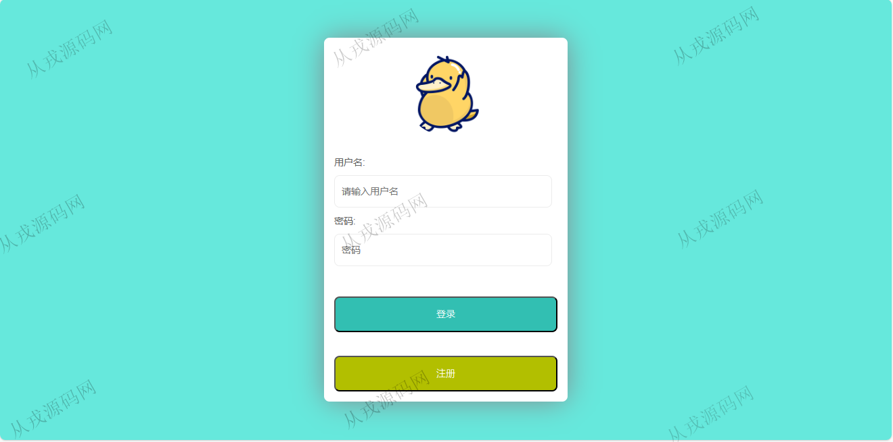
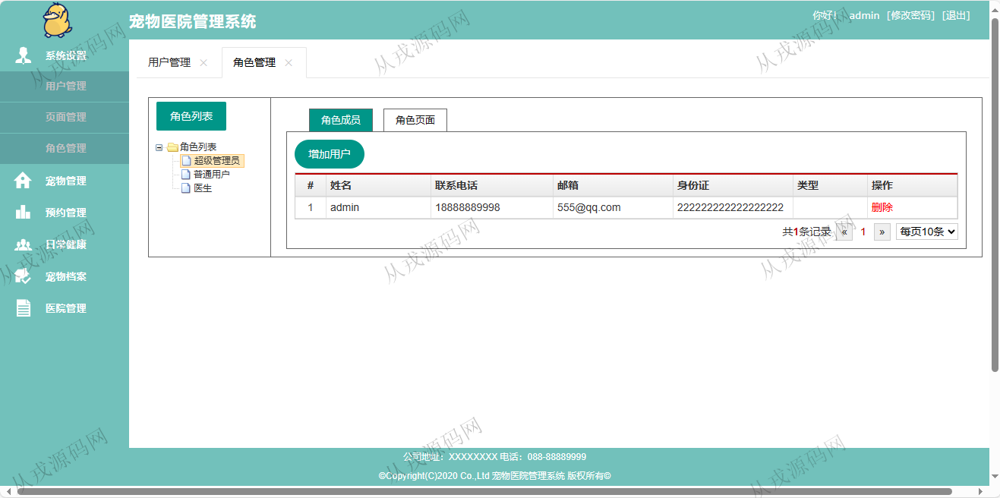
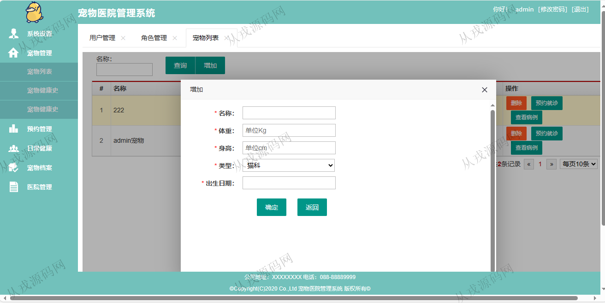
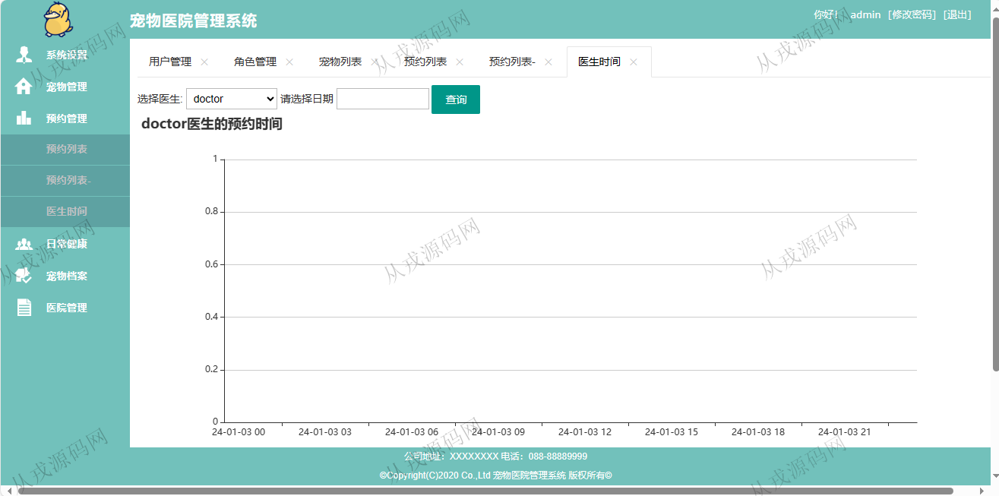
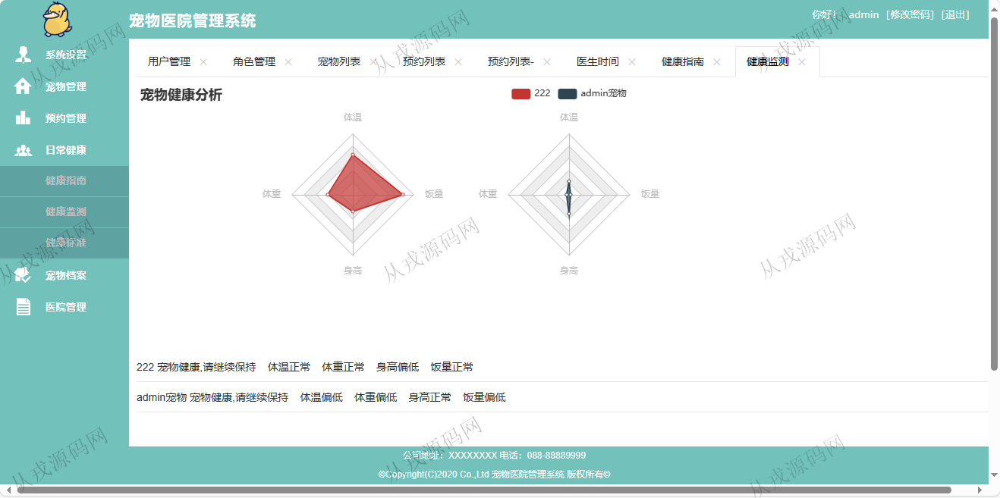
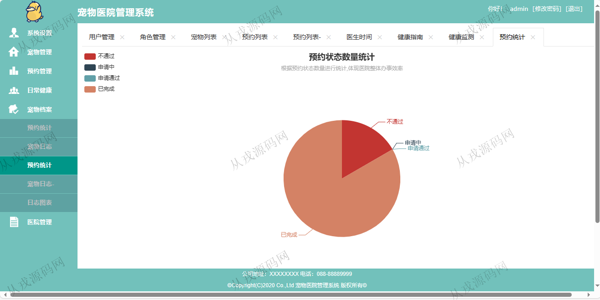
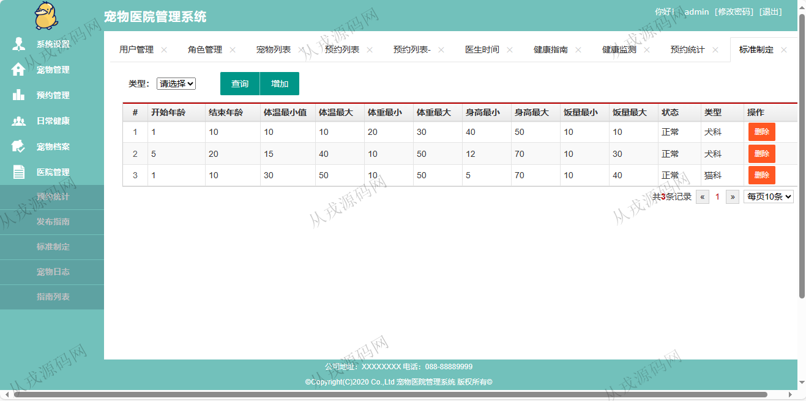
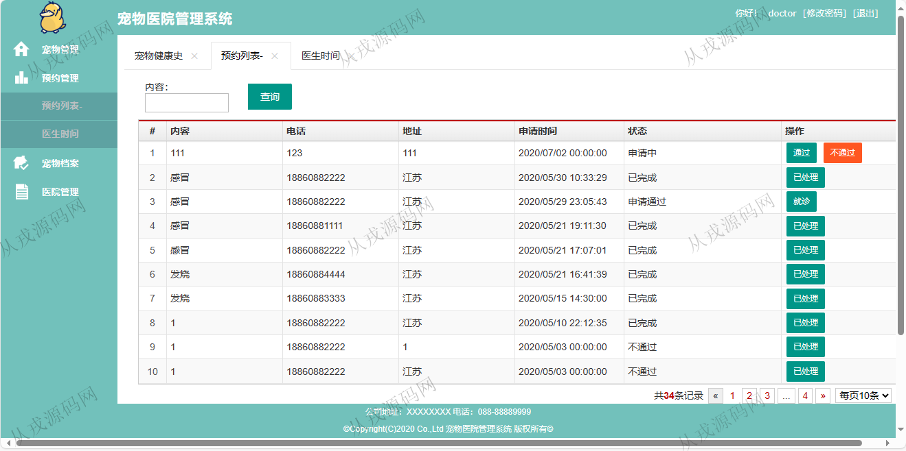

<h1 align="center">98.宠物医院管理系统</h1>

 获取sql文件 QQ: 386869957 QQ群: 377586148 

 [推荐站点: 从戎源码网](https://armycodes.com/) 

## 简介

> 本代码来源于网络,仅供学习参考使用!
>
> 提供1.远程部署/2.修改代码/3.设计文档指导/4.框架代码讲解等服务
> 
> 登录地址：http://localhost:8080/
> 
> 管理员：admin 123456
> 
> 医生：doctor 123456
> 
> 用户：user 123456
>

## 项目介绍
基于springboot的宠物医院管理系统：前端 thymeleaf、jquery、echarts，后端 maven、spring、shiro、mybatis，角色分为管理员、医生、用户；集成宠物管理、预约管理、宠物档案、医院管理等功能于一体的系统。

## 功能介绍

### 管理员

- 系统设置：用户信息的增删查，页面管理的菜单信息的增删改查，角色信息的增删改查
- 宠物管理：宠物列表查询，宠物添加，删除，查看病例，预约就诊，宠物健康史
- 预约管理：预约信息列表查询，通过与不通过，医生时间查询
- 日常健康：健康指南，健康监测，健康标准
- 宠物档案：预约统计（饼图），宠物日志，日志图表
- 医院管理：预约统计，发布指南，标准制定，宠物日志，指南列表

### 医生

- 宠物管理：宠物健康史列表查询，关键词搜索，删除
- 预约管理：预约信息列表查询，通过与不通过，医生时间查询
- 宠物档案：宠物日志列表查询，名称关键词搜索
- 医院管理：预约统计，发布指南，标准制定，宠物日志，指南列表

### 用户

- 宠物管理：宠物列表查询，增加宠物，删除，查看病例，预约就诊，宠物健康史查询
- 预约管理：预约信息列表查询，增加预约申请，医生时间查询
- 日常健康：健康指南，健康监测，健康标准
- 宠物档案：预约统计（饼图），宠物日志，日志图表

## 环境

- <b>IntelliJ IDEA 2021.3</b>

- <b>Mysql 5.7.26</b>

- <b>JDK 1.8</b>

## 运行截图

